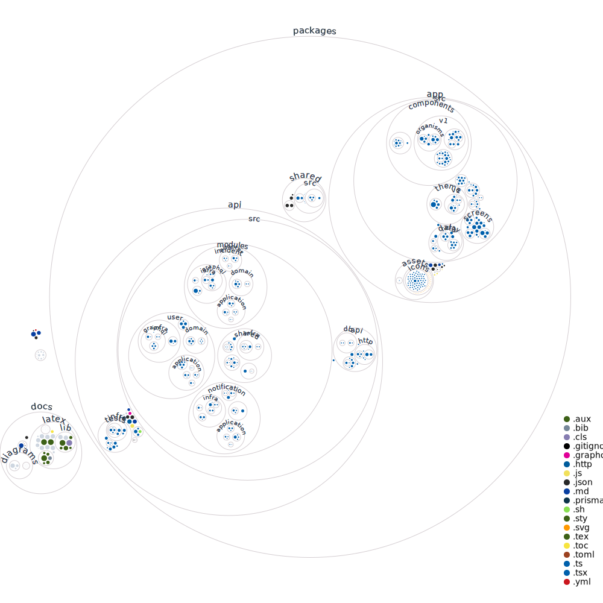

# Schedule

- planning:

  - at least:
    - signup & signin, incident publishing
    - background and foreground user location tracking
    - push notifications about new incidents for relevant users
    - i18n support
    - notification as entity
    - redesign of all screens
      - git commit -m '[app] initial setup of tamagui'
        - gradually and testing each component at time!
      - individual incident view 
      - report screen (with video upload)
      - notifications view
      - nearby incidents map view
    - user interacting with another incidents
      - user react, user comment, user upvote/downvote comments

  - would be nice:
    - 08/01 - 09/01: user friendships, friends map view with (with real-time updates?)
    - 15/01 - 16/01: user-user chat
    - 22/01 - 23/01: incidents fetching filtering within screen
    - 29/01 - 30/01: reputation system, user editing your owned incidents

- maybe:
  - git commit -m '[api/app] add logout mutation (when user logout remove user devices that are listening for push notifications)'
  - git commit -m '[api] add pino logger'
  - git commit -m '[shared] add common types'
  - git commit -m '[app] bump relay to v13.0.0.0 (with rust compiler)'
  - git commit -m '[api] bump graphql-js to v16.0.0'
  - git commit -m '[api/app] refactor to graphql upload'
    - https://github.com/jaydenseric/graphql-upload
    - multipart request over graphql (use busboy under the hood)

- goal:
  - 01/02: frontend+backend 100% pronto localmente (3a apresentacao pro remo)
  - 15/02: monografia escrita (4a apresentacao pro remo)
  - 01/03: apresentacao criada (apresentacao na banca final)

- deploy
  - backend
    - heroky (git push e ja ta no ar)
  - app
    - set up Expo Android app to get push notifications using your own Firebase Cloud Messagign (FCM) credentials: https://docs.expo.dev/push-notifications/using-fcm 
    - expo: read the [permissions on iOS](https://docs.expo.dev/guides/permissions/#ios) and [permissions on Android](https://docs.expo.dev/guides/permissions/#android) sections carefully before deploying your app to stores

# Requirements

## Functional requirements (e os use cases que ele contem)

- 1. usuários devem ser capazes de publicar alertas

  - upload de fotos e vídeos:

    - é obrigatório o upload de pelo menos uma mídia
    - vídeos devem ser de curta duração
    - toda mídia deve ter sido gravada no momento atual, dentro de uma margem de 1 hora
    - toda mídia deve ter sido gravada no local em que o usuário está, dentro de uma margem de 2 km

  - não deve ser criado se:

    - houverem outros alertas ativos muito próximos ao do novo alerta
      <!-- tentativa de evitar duplicações de alertas -->

  - o alerta criado deve assumir a localização atual de quem o criou

- 2. usuários e anônimos devem visualizar um mapa de alertas

  - visão geral dos alertas:

    - default view: alertas mais recentes (criados nas últimas 24 horas) e nas proximidades
    - trend view: alertas ativos mais populares (com mais interações) de qualquer lugar
    - stats:
      - quantidade de usuários nas proximidades

  - visão de um alerta específico:
    - stats:
      - quantidade de usuário notificados
      - tempo relativo em relação à última atualização do alerta
      - quantidade de reações
      - quantidade de comentários

- 3. usuários devem ser notificados quando alertas forem publicados nas suas proximidades por outros usuários

- 4. usuários podem interagir em qualquer alerta ativo publicado por outro usuário
  <!-- sem chat real-time, pois teria muitos usuários conectados -->

  - usuário qualquer pode reagir ao alerta
  - usuário qualquer pode adicionar um comentário ao alerta
  - usuário qualquer pode responder comentários de outros usuários
  - usuário qualquer podem dar upvote/downvote nos comentários de outros usuários

  <!-- - usuários podem reportar o alerta? -->
    <!-- se estão em conformidade com app guidelines -->
    <!-- todo: usuários reportam/denunciam outros usuários? -->
    <!-- todo: usuários se auto moderam? avaliam e são avaliados? main moderators avaliam usuarios, e ai seu peso vale mais? -->

- 5. usuários podem colaborar com o contéudo de alertas publicados por outros usuários e que estão nas suas proximidades

  - usuário colaborante pode adicionar novas fotos/vídeos

- 6. usuários podem modificar seus próprios alertas

  - usuário criador pode "encerrar" o alerta
  - usuário criador pode remover qualquer colaboração adicionada por outro usuário

  <!-- todo: usuário criador pode ajustar a localização do alerta? -->
    <!-- área ajustável disponível? ex: dentro de 100 metros de distância da localicação atual do alerta -->
    <!-- mas ai precisaria limitar também o número de ajustes permitidos -->

- 7. usuários podem adicionar outros usuários como amigos

  - no envio da solicitação e no aceite de uma solicitação, o usuário deve ser lembrado de adicionar apenas usuários em que ele confia, pois estará compartilhando a sua localização em tempo real com ele

- 8. usuários que são amigos podem conversar em um chat privado 1-1 em tempo real

- 9. usuários visualizam no mapa a localização em tempo real de seus amigos

- 10. usuários podem cadastrar localidades para "ouvir" por alertas
  <!-- - exemplos: casa dele, casa da vó, local de trabalho -->

- 11. usuários devem podem acessar o perfil de outros usuários

  - stats:
    - quantidade de alertas publicados por ele
    - quantidade média de upvotes e downvotes

## Non-functional requirements

- o sistema deve ser seguro

  - para atender isso:
    - cadastro deve ser único por número de celular, ou email
    - cadastro deve ser seguro (provedor de identidade terceiro, autenticação em dois fatores)

- o sistema deve ser altamente disponível, e em virtude disso, é aceitável uma temporária inconsistência

  - para atender isso:
    - usar servicos AWS que forneçam redundancia, como múltiplos instancias de servidores, banco de dados com replicas, storage system distribuido etc
    - [https://docs.microsoft.com/en-us/dotnet/architecture/microservices/architect-microservice-container-applications/scalable-available-multi-container-microservice-applications](https://docs.microsoft.com/en-us/dotnet/architecture/microservices/architect-microservice-container-applications/scalable-available-multi-container-microservice-applications)
    - preço de uma event-driven architecture: eventual consistencia (enquanto evento esta no broker, dados inconsistentes)

- o sistema deve ser acessível globalmente

- o sistema deve ser altamente confiável, qualquer foto ou vídeo carregado nunca deve ser perdido

  - para atender isso:

- usuários devem ter uma experiência no aplicativo em tempo real

- o sistema deve suportar uma alta carga de leituras com latência mínima (busca e visualização de alertas, fotos/vídeos), sendo tolerável uma maior latência em escritas (upload de novas fotos/vídeos), pois haverá menos carga de escrita
  - para atender isso:
    - otimizar para leitura

# Some definitions

Active user: when user is with app opened (websocket connection stablished)
Relevant users: users that are located nearby to one incident
User session: an auth token life cycle (access token & refresh token)

# See it later

- real-time updates

  - https://mattkrick.medium.com/graphql-after-4-years-scaling-subscriptions-d6ea1a8987be

  - all active app users keep a connection open with the server (websocket with GraphQL Subscription) to receive updates about

    - [ ] progresso de upload de arquivos
    - [ ] novo alerta criado na proximidade
    - [ ] nova interação em alertas ativos na proximidade
    - [ ] quantidade de usuarios nos arredores (não necessariamente logados)
    - [?] chat 1-1
      <!-- https://www.youtube.com/watch?v=E3NHd-PkLrQ -->
      <!-- https://dev.to/dsckiitdev/build-a-chat-app-with-graphql-subscriptions-typescript-part-2-3k35 -->

  - user location tracking
    - [ ] near real-time user location updates, only between a friendship group of users
      <!-- https://www.infoworld.com/article/3128306/build-geospatial-apps-with-redis.html -->
        <!-- https://github.com/RedisLabs/geo.lua#location-updates -->
          <!-- When you combine this geospatial support with other Redis capabilities, some interesting functionality becomes extremely simple to implement. For example, by melding the new Geo Sets and PubSub, it is nearly trivial to set up a real-time tracking system in which every update to a member’s position is sent to all interested parties (think of a running or biking group where you want to track group members locations in real time). -->

# Tech stack

- javascript (language)
- typescript (type system)
- node (backend runtime)
- koa (server framework)
- graphql (API)
- vscode (IDE)
- recoil ("global" state management)
- ws + graphql-ws (for websockets)
- relay (declarative data fetching)
- redis (cache, queue management, pubsub)
- jest (test framework)
- supertest (HTTP tests)
- prettier (code formatting)
- prisma (database ORM)
- github actions (CI/CD)
- eslint (lint rules)
- internationalization: [i18next](https://www.i18next.com)

- react (declarative UI)
- react native (native apps)
- expo

- React Native framework for building native apps with React
- Expo library for better development experience
- Relay framework for using GraphQL with React
- TypeScript language for type checking and better code quality
- React Navigation library for navigation

<!-- - mongoose (mongo schema) -->
<!-- - bulljs (event driven distributed jobs) -->
<!-- - webpack (bundling server and frontend apps) -->
<!-- - rollup (bundling for packages and libraries) -->
<!-- - babel (enable modern syntax and plugins) -->
<!-- - jscodeshift (codemod) -->
<!-- - openapi (API REST documentation) -->
<!-- - docusuarus (documentation) -->
<!-- - hygen (codegen) -->
<!-- - styled-components (css in js) -->
<!-- - storybook (design system and email builder) -->
<!-- - testing library (testing dom) -->
<!-- - material-ui (ui base components) -->
<!-- - styled-system (functional css) -->
<!-- - react-router (routing) -->
<!-- - nivo + d3 (for charts) -->
<!-- - react-table (table management) -->
<!-- - draftjs (richtext) -->
<!-- - formik (forms) -->
<!-- - fastlane (android/ios deploy automation) -->

# Project structure visualization

